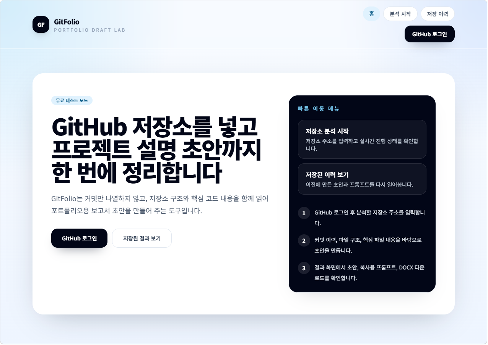
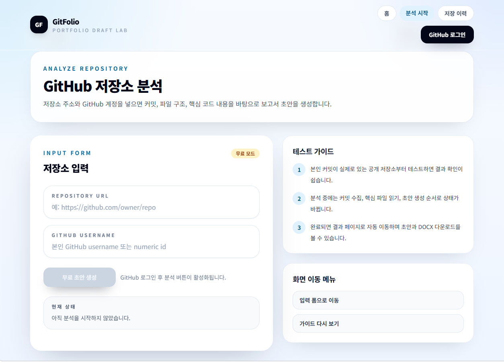
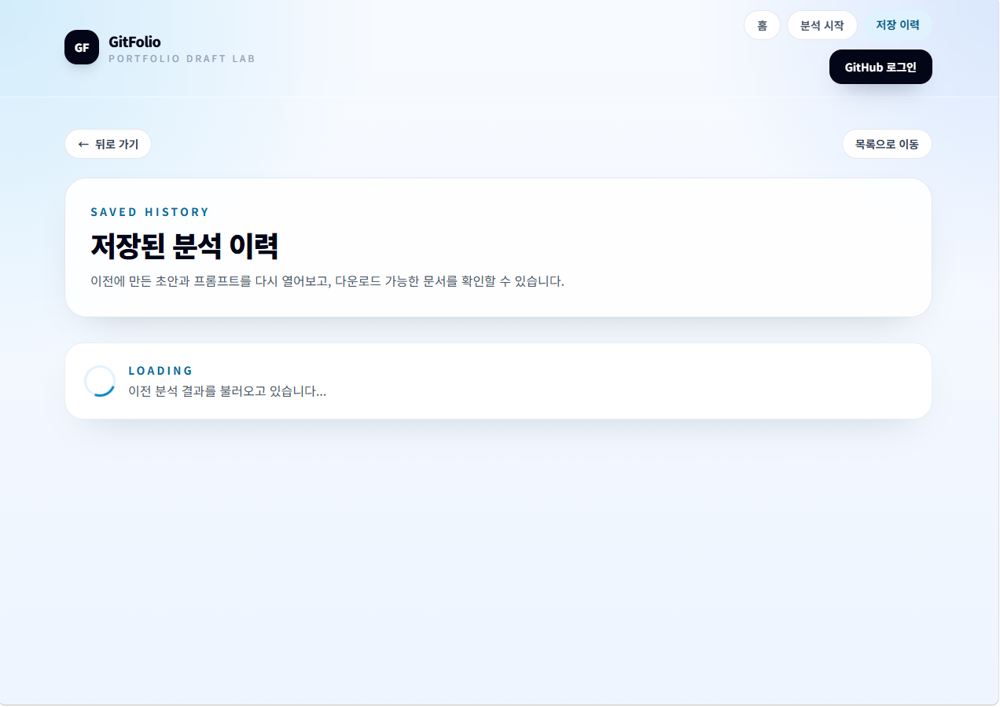

# GitFolio

> GitHub 저장소 URL을 바탕으로 취업용 프로젝트 초안을 자동 생성하는 포트폴리오 드래프트 서비스입니다.  
> 저장소 구조, README, 주요 파일, 커밋 변경 내역을 함께 분석해 이력서용 문장과 외부 AI 전달용 프롬프트를 정리합니다.


---

## 목차

1. [소개](#소개)
2. [주요 화면](#주요-화면)
3. [핵심 기능](#핵심-기능)
4. [기술 스택](#기술-스택)
5. [아키텍처 개요](#아키텍처-개요)
6. [실행 방법](#실행-방법)
7. [환경 변수](#환경-변수)
8. [배포 구성](#배포-구성)
9. [프로젝트 구조](#프로젝트-구조)
10. [테스트](#테스트)

---

## 소개

GitFolio는 개발자가 자신의 GitHub 저장소를 바탕으로 이력서용 프로젝트 소개 문장을 빠르게 정리할 수 있도록 만든 서비스입니다.

- GitHub OAuth 로그인 후 저장소 URL 기반 분석
- 저장소 구조, README, 주요 변경 파일, 핵심 코드 흐름 분석
- 이력서용 초안과 외부 AI 전달용 프롬프트 동시 생성
- DOCX 다운로드 지원
- 로컬 개발 환경에서는 Ollama, 배포 환경에서는 Claude API 기반 초안 생성 지원

---

## 주요 화면

### 1. 홈 화면



- 서비스 소개와 로그인 진입점 제공
- GitFolio의 사용 목적과 전체 흐름을 첫 화면에서 확인 가능
- GitHub 로그인 후 분석 흐름으로 자연스럽게 이동

### 2. 분석 시작 화면



- GitHub 저장소 URL 입력
- 분석 진행 상태를 SSE 기반으로 실시간 확인
- 초안 생성 모드와 결과 흐름을 한 화면에서 확인 가능

### 3. 저장 이력 화면



- 이전 분석 결과 목록 조회
- 저장된 보고서 재열람
- 결과 페이지로 이동해 초안, 기술 스택, 외부 AI 전달용 프롬프트를 다시 확인 가능

---

## 핵심 기능

### 1. 저장소 분석

- GitHub 저장소 메타데이터 수집
- 본인 커밋 필터링 및 변경 파일 요약
- 저장소 트리와 핵심 파일 내용 수집
- README, `package.json`, `requirements.txt`, `app.py`, `main.py`, `.ipynb` 등 주요 파일 기반 맥락 파악

### 2. 초안 생성

- 이력서 형식에 맞춘 프로젝트 초안 생성
- `프로젝트명 / 주요 업무 / 담당 역할 / 기술 스택 / 업무 기간 / 개발 인원 / 상세 내용` 구조 제공
- 저장소 전체 흐름과 본인 기여 요약을 함께 참고해 초안 구성

### 3. 외부 AI 전달용 프롬프트 생성

- ChatGPT, Claude 같은 외부 AI에 붙여 넣을 수 있는 프롬프트 제공
- 저장소 전체 기능 흐름과 본인 기여 요약을 함께 담아 재작성 품질 보조

### 4. 결과 문서화

- 보고서 저장 이력 관리
- DOCX 다운로드 지원
- 배포 환경에서는 PDF 비활성화 옵션 지원

---

## 기술 스택

### Frontend

- React
- Vite
- Tailwind CSS
- Axios
- React Router

### Backend

- FastAPI
- SQLAlchemy
- SQLite
- Python
- JWT Auth
- SSE (StreamingResponse)

### LLM / Analysis

- Claude API
- Ollama
- Rule-based fallback

### Deploy

- Netlify
- Render

---

## 아키텍처 개요

### Frontend

- 홈 / 분석 시작 / 저장 이력 / 결과 페이지 구성
- SSE 기반 분석 상태 스트리밍 UI
- 결과 미리보기 및 다운로드 버튼 제공

### Backend

- GitHub OAuth 인증
- 저장소 정보 / 커밋 / diff / 주요 파일 수집
- 저장소 특성 분석 및 기술 스택 추출
- LLM 또는 규칙 기반 초안 생성

### Draft Generation Flow

1. GitHub 로그인
2. 저장소 URL 입력
3. 저장소 메타데이터, 커밋, 변경 파일, 핵심 파일 분석
4. 저장소 특성 기반 초안 생성
5. 결과 저장 및 DOCX 다운로드

---

## 실행 방법

### 1. 백엔드 실행

```bash
cd backend
python -m venv venv
venv\Scripts\activate
pip install -r requirements.txt
uvicorn app.main:app --reload
```

### 2. 프론트엔드 실행

```bash
cd frontend
npm install
npm run dev
```

### 3. 로컬 접속

- Frontend: `http://localhost:5173`
- Backend: `http://127.0.0.1:8000`

---

## 환경 변수

### Backend

`backend/.env` 예시

```env
ENV=local
USE_CLOUD_LLM=false
OLLAMA_ENABLED=true
ENABLE_PDF=true
GITHUB_CLIENT_ID=your_client_id
GITHUB_CLIENT_SECRET=your_client_secret
GITHUB_REDIRECT_URI=http://127.0.0.1:8000/api/v1/auth/github/callback
FRONTEND_URL=http://localhost:5173
JWT_SECRET=your_jwt_secret
```

### Frontend

`frontend/.env.local` 예시

```env
VITE_API_BASE_URL=http://127.0.0.1:8000/api/v1
```

---

## 배포 구성

### Frontend

- Netlify
- `frontend` 디렉터리 기준 빌드
- `npm run build`

### Backend

- Render Web Service
- `backend` 디렉터리 기준 실행
- `uvicorn app.main:app --host 0.0.0.0 --port $PORT`

### LLM 전략

- 로컬: Ollama
- 배포: Claude API
- 둘 다 실패 시: 규칙 기반 fallback

---

## 프로젝트 구조

```text
GitFolio/
├─ backend/
│  ├─ app/
│  │  ├─ api/
│  │  ├─ core/
│  │  ├─ db/
│  │  ├─ models/
│  │  ├─ schemas/
│  │  ├─ services/
│  │  │  ├─ github/
│  │  │  ├─ llm/
│  │  │  └─ report/
│  │  └─ utils/
│  ├─ generated_reports/
│  └─ tests/
├─ frontend/
│  ├─ src/
│  │  ├─ api/
│  │  ├─ components/
│  │  ├─ hooks/
│  │  ├─ pages/
│  │  ├─ store/
│  │  └─ styles/
└─ README.md
```

---

## 테스트

### Backend

```bash
cd backend
venv\Scripts\python -m pytest tests\unit
```

### Frontend

```bash
cd frontend
npm run build
```

---

GitFolio는 “저장소를 바탕으로 이력서 초안을 빠르게 만들 수 있는 시연형 서비스”를 목표로 계속 개선 중입니다.
